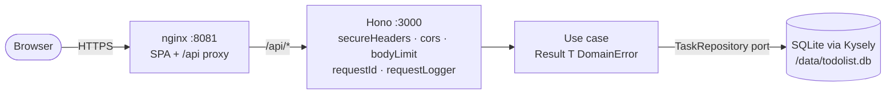
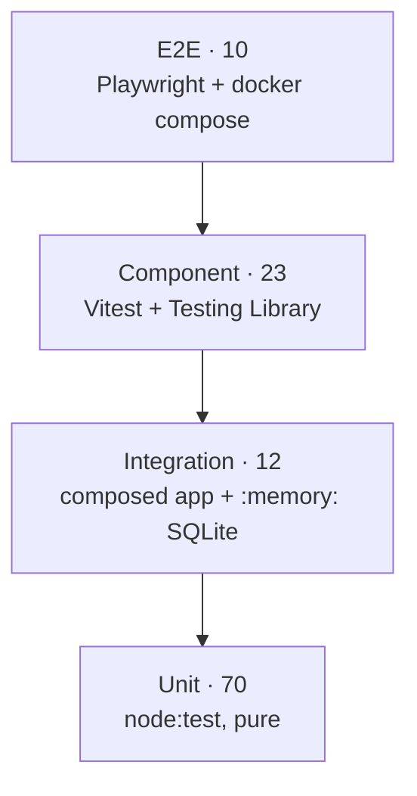

# Todolist

> State-of-the-art TypeScript 2026 reference app: production-ready, hexagonal, multi-layer tested, fully containerised.

## Quickstart (30 seconds)

```bash
git clone <this repo> && cd todolist
docker compose up --build
```

App: <http://localhost:8081> · API readiness: <http://localhost:3000/readyz>

That's it. SQLite lives on a named volume; the FE talks to the API at the relative path `/api/...` via an nginx reverse proxy.

## Local development

```bash
npm install            # workspaces (Node 24+, npm 11+); installs lefthook hook
npm run dev            # backend :3000 + Vite :5173 in parallel (Vite proxies /api → :3000)
npm run check          # lint + typecheck + layers + tests + bundle budget — green-bar gate
npm run build          # tsc + vite build per package
```

Granular scripts:

| Script | What it does |
|---|---|
| `npm run lint` / `npm run format` | Biome (ADR-0010) |
| `npm run typecheck` | `tsc --noEmit` per workspace |
| `npm run check:layers` | `dependency-cruiser` enforces hex-layer imports (ADR-0032) |
| `npm run test` | unit + integration (BE) + component (FE), `node:test` + Vitest |
| `npm run test:integration` | BE integration only |
| `npm run check:bundle-size` | builds the FE and asserts JS ≤ 110 kB / CSS ≤ 8 kB gzipped |
| `npm run test:e2e` | Playwright suite against the docker-composed stack |
| `npm run test:e2e:ui` / `:headed` / `:report` | Playwright variants |

## Architecture



Three runtime workspaces — `packages/backend`, `packages/frontend`, `packages/shared` — coordinated by npm workspaces. Each runtime package follows a hexagonal layout: `domain/` (pure logic) → `application/` (use cases + ports) → `adapters/` (HTTP, persistence, UI) → `main.ts` as the composition root. The `packages/e2e` workspace is a black-box Playwright suite against the docker-composed stack.

Stack: Node 24 + Hono + `node:sqlite` + Kysely on the BE; React 19 + Vite + Tailwind v4 + TanStack Query v5 on the FE. Zod is the wire contract on both sides.

See [`docs/architecture.md`](docs/architecture.md) for the full layout and operational concerns; [`docs/decisions/README.md`](docs/decisions/README.md) for the ADRs that justify each choice.

## Testing



115 tests across four layers. Each layer has a strict scope — see [`docs/testing.md`](docs/testing.md) for what each does and does NOT do.

## CI

[`.gitlab-ci.yml`](.gitlab-ci.yml) gates every push and merge request:

1. **`check`** — lint, typecheck, layers, tests in parallel on Node 24 alpine.
2. **`build`** — produces FE + BE bundles. Bundle-size budget runs here.
3. **`e2e`** — Playwright against the docker-composed stack on the official Playwright image (docker-in-docker). Failure-only artifact upload.

Branch protection should require all jobs to pass. Cf. ADR-0031.

## Conventions

- **No `any`.** No `// @ts-expect-error` without an ADR or issue-linked comment.
- **Comments only when explaining a non-obvious *why*.**
- **Errors as typed values** at the domain layer (`Result<T, DomainError>`). Throw only for programmer errors.
- **Validate at boundaries, trust internally.** Zod parses request payloads and constructs value objects; once inside the domain, types are guaranteed.
- **Prefer Node built-ins** (`node:test`, `node:sqlite`, `--experimental-strip-types`) over third-party deps where reasonable.

Full conventions list in [`CLAUDE.md`](CLAUDE.md).

## License

UNLICENSED — personal showcase, not for redistribution.
