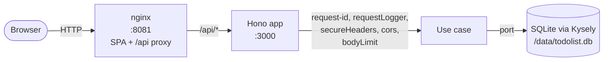
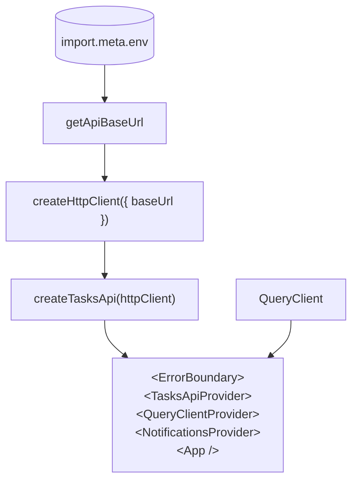

# Architecture

How the code is organised and why. This document is the standalone explainer; the **why** behind every choice lives in [the ADRs](./decisions/README.md). New contributors should read this top-to-bottom; future Claude sessions should treat ADRs as the source of truth.

## Workspaces

Four packages, coordinated by npm workspaces (ADR-0001):

| Package | Role | Key deps |
|---|---|---|
| `packages/shared` | API contract — Zod schemas + inferred types. **No business logic.** | `zod` |
| `packages/backend` | Hono app + `node:sqlite` persistence. Hexagonal layout. | `hono`, `kysely`, `pino` |
| `packages/frontend` | React 19 SPA. Hexagonal layout. | `react`, `@tanstack/react-query`, `tailwindcss` |
| `packages/e2e` | Playwright suite. Black-box test of the docker-composed stack. | `@playwright/test` |

Each runtime package follows the hexagonal layout from ADR-0013: `domain/` (pure logic) → `application/` (use cases + ports) → `adapters/` (concrete implementations) → composition root (`main.ts` for BE, `main.tsx` for FE). Layer-direction is enforced mechanically by `npm run check:layers` (ADR-0032).

## Request flow

In dev, Vite (`:5173`) replaces nginx — same `/api` proxy, same source code, different host. The FE bundle never references an absolute API host (ADR-0023): it always calls `/api/...` and the proxy decides where that lands.

## Backend composition

`packages/backend/src/index.ts` is the entrypoint. It loads `Config` from the environment (ADR-0022), opens the SQLite handle, builds the `App`, and registers shutdown handlers. It is the only place that wires concrete adapters into ports.

```mermaid
flowchart TB
  Env[(process.env)]
  Config[loadConfig]
  Wire["openWiredDatabase(path)<br/>= repo + readiness + dispose"]
  Compose["compose({ tasks, clock, ids,<br/>logger, corsOrigin,<br/>maxBodyBytes, readiness })"]
  App[App = Hono&lt;RequestIdEnv&gt;]
  Server[serve&#40;:PORT&#41;]
  Sigterm{{SIGTERM / SIGINT}}

  Env --> Config
  Config --> Wire
  Wire --> Compose
  Config --> Compose
  Compose --> App
  App --> Server
  Sigterm -. graceful .-> Server
```

### Layers

- **`domain/`** — `Task` aggregate, `TaskId` and `TaskTitle` value objects, `taskNotFound` and `validationError` constructors. Pure functions, no I/O. Cannot import from `application/` or `adapters/`.
- **`application/`** — six use cases (`add`, `list`, `update`, `complete`, `reopen`, `delete`), each pure: domain in, `Result<T, DomainError>` out (ADR-0017). Ports for `TaskRepository`, `Clock`, `IdGenerator` (ADR-0016).
- **`adapters/http/`** — Hono routes plus middleware (`requestId`, `requestLogger`, `secureHeaders`, `cors`, `bodyLimit`, `internalErrorHandler`). Routes parse via `parseIdParam` / `parseJsonBody` helpers and respond via `respondOk` / `respondCreated` / `respondNoContent` / `respondValidationError`.
- **`adapters/persistence/sqlite/`** — `node:sqlite` + Kysely. `initSchema` is idempotent on boot (ADR-0021); no migration runner today. `task-repository.ts` implements the port.
- **`main.ts`** — `compose(deps)` wires everything. The only file that imports concrete adapters into the application/domain graph.

### REST surface

Per ADR-0018:

| Verb | Path | Purpose | Status |
|---|---|---|---|
| GET | `/healthz` | Liveness; no I/O. | 200 |
| GET | `/health` | Back-compat alias for `/healthz`. | 200 |
| GET | `/readyz` | Readiness; queries DB via `SELECT 1`. | 200 / 503 |
| GET | `/tasks` | List, `createdAt`-descending. | 200 |
| POST | `/tasks` | Create. | 201 + `Location` |
| PATCH | `/tasks/:id` | Update title (idempotent if unchanged: same `updatedAt`). | 200 / 400 / 404 |
| POST | `/tasks/:id/complete` | Mark complete (idempotent). | 200 / 404 |
| POST | `/tasks/:id/reopen` | Mark pending (idempotent). | 200 / 404 |
| DELETE | `/tasks/:id` | Delete. | 204 / 404 |

Errors use the typed envelope `{ error: { kind, ... } }` (ADR-0020). The `ApiError` discriminated union lives in `@todolist/shared` (ADR-0019).

## Frontend composition

`packages/frontend/src/main.tsx` builds the dependency graph and mounts React.

### Layers

- **`domain/`** — `Result<T, E>` tagged union, `ApiClientError` discriminated union (FE-local superset of the wire `ApiError`), `ApiClientErrorException` (Error subclass — what hooks throw so `query.error` / `mutation.error` carries a stack trace, ADR-0027).
- **`application/`** — `api-context.tsx` (TasksApi via React context), `queries/` (one hook per HTTP action: `useTasksQuery` + five mutations), `notifications/` (provider + reducer + `formatApiClientError`), `formatting/format-task-timestamp.ts` (Intl, ADR-0024). No React components, no DOM.
- **`adapters/api/`** — `http-client.ts` (fetch wrapper with request-id propagation + Zod-validated responses, returns `Result`), `tasks-api.ts` (per-resource client, ADR-0025), `api-base-url.ts` (reads `VITE_API_BASE_URL`, defaults to `/api`).
- **`ui/`** — React components. `AppShell` mounts `NotificationsViewport` (portaled to `document.body`, ADR-0028). `TaskList` hosts `AddTaskForm` and renders `TaskRow`s. `ErrorBoundary` is still a class — React 19 has no functional equivalent.

### State strategy

Server state via TanStack Query v5; no client-state library. Mutations follow the uniform pattern (ADR-0027): `cancelQueries → snapshot → setQueryData(optimistic) → onSuccess(reconcile) → onError(rollback) → onSettled(invalidate)`. Optimistic UI on every action; rollback drives an error toast that carries the BE's `requestId`.

## Operational concerns

| Concern | Where | ADR |
|---|---|---|
| Configuration validation | `loadConfig(env)` — refuses to start if any required var is missing or malformed. | 0022 |
| Health (liveness) | `GET /healthz` — no I/O. | 0022 |
| Readiness | `GET /readyz` — `SELECT 1` via `ReadinessProbe`. 503 on failure. | 0022 |
| Structured logs | Pino with `password`/`token`/`authorization` redaction; per-request middleware. | 0005, 0022 |
| Graceful shutdown | `SIGTERM`/`SIGINT` → `server.close()` (awaited) → `dispose()` (DB handle). | 0022 |
| Body size limit | `bodyLimit(MAX_BODY_BYTES)` on every route; rejects requests without `Content-Length`. | 0022 |
| Security headers (BE) | Hono `secureHeaders` + a defensive `Content-Security-Policy: default-src 'none'; frame-ancestors 'none'` for the JSON API. No `X-Powered-By`. | 0022 (S7 addendum) |
| Security headers (FE) | nginx serves CSP, HSTS, X-Frame-Options, Referrer-Policy, Permissions-Policy, COOP, CORP. `server_tokens off`. | 0029 |
| Crash safety | `uncaughtException` + `unhandledRejection` log fatally and exit code 1. | 0022 |
| Bundle budget | `scripts/check-bundle-size.mjs` — JS ≤ 110 kB, CSS ≤ 8 kB gzipped (current 89 / 3.28 kB). | 0029 |
| Hex-layer enforcement | `npm run check:layers` (`dependency-cruiser`). | 0032 |
| Pre-commit | `lefthook` — `biome check --write` on staged files. | 0033 |

## Containers

Per ADR-0012, each runtime package ships a multi-stage Dockerfile:

- **`packages/backend/Dockerfile`** — Alpine Node 24, builder produces `dist/`, runtime runs as the `node` user. `/data` volume for SQLite. Healthcheck on `/readyz`.
- **`packages/frontend/Dockerfile`** — Alpine Node 24 builder + `nginx:1.27-alpine` runtime serving the SPA + the `/api` reverse proxy. Healthcheck on `/healthz`.
- **`docker-compose.yml`** — wires both with `depends_on: backend.condition: service_healthy`. SQLite lives on a named volume so data survives `docker compose restart`.

E2E uses the same compose file via `globalSetup` (ADR-0030) — the test stack is the production stack.

## CI

`.gitlab-ci.yml` (ADR-0031) gates every push:

1. **`check`** — `lint`, `typecheck`, `layers`, `test` in parallel on Node 24 alpine.
2. **`build`** — produces FE + BE bundles. Bundle-size budget runs here.
3. **`e2e`** — Playwright against the docker-composed stack on the official Playwright image with docker-in-docker. Failure-only artifact upload (trace, screenshot, video).

Runs on pushes and merge requests. Branch protection should require all jobs to pass (set up server-side once a remote exists).

## Pointers

- [`docs/decisions/README.md`](decisions/README.md) — every architectural decision, with status.
- [`docs/testing.md`](testing.md) — what each test layer does and does not do.
- [`CLAUDE.md`](../CLAUDE.md) — for future Claude sessions: scripts table, conventions, layering, token tips.
